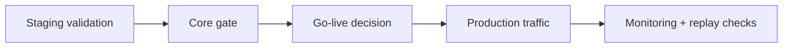

# Operations

This section is the production operations entry point.

The goal here is not to impress with process. It is to help a team answer a concrete question: if Aionis becomes part of a real workflow, what must be checked before rollout, watched during steady state, and preserved when something goes wrong?

## What you will learn

1. How to run go-live checks safely.
2. How to monitor critical production signals.
3. How to use replay in incident response and verification.

## What this section covers

1. Go-live readiness checks.
2. Monitoring and SLO guardrails.
3. Incident response with replay workflow.
4. Repeatable operational runbooks.
5. Release-safe rollback and evidence practices.

That scope is intentionally operational rather than architectural. By the time someone is reading this section, the product question should already be answered. The remaining question is whether the system can be rolled out, watched, and debugged without turning every incident into a forensic guessing exercise.

## Task-driven operating paths

1. Go live this week:
   start with [Go-live Checklist](/operations/go-live), then run [Monitoring and SLO](/operations/monitoring).
2. Investigate an incident now:
   start with [Incident Response and Replay](/operations/incident-response), then [Runbooks](/operations/runbooks).
3. Build evidence for change approval:
   use [Verification Status](/reference/verification-status), [Replay APIs](/api-reference/replay), and [Governance](/reference/governance).

Those three paths cover most real operator needs. A team about to ship cares about readiness and rollback. A team in an incident cares about identifiers, replay, and evidence. A team changing controls or rollout posture cares about governance and proof. Keeping those paths separate helps prevent operations pages from becoming a pile of undifferentiated checklists.

## Best applied operations example

If you want one public example of Aionis operating around a real agent tool loop, use [OpenClaw Adapter](/how/openclaw-adapter).

It is useful here because it shows the operational shape of:

1. pre-tool policy control
2. post-tool feedback capture
3. replay-based rerouting
4. handoff when a run should stop and resume elsewhere

## Operating model

## Daily operator checklist

1. Verify health status and key service metrics.
2. Run policy sanity checks on a target scope.
3. Validate one replay chain from recent traffic.

That last item is especially valuable. A replay chain that cannot be reconstructed when the system is calm will not magically become easy to reconstruct during an incident. Small regular checks make incident response much less theatrical.

## Weekly operator checklist

1. Run governance and evidence workflows.
2. Review SLO trend and incident noise.
3. Confirm rollback and drill readiness.

## How to navigate this section

Use the left sidebar to move between checklists, monitoring, incident response, and runbooks.

If you are operating Aionis for the first time, start with [Go-live Checklist](/operations/go-live). If the system is already live and your question is about steady-state trust, move to [Monitoring And SLO](/operations/monitoring). If something already failed, go directly to [Incident Response And Replay](/operations/incident-response).
